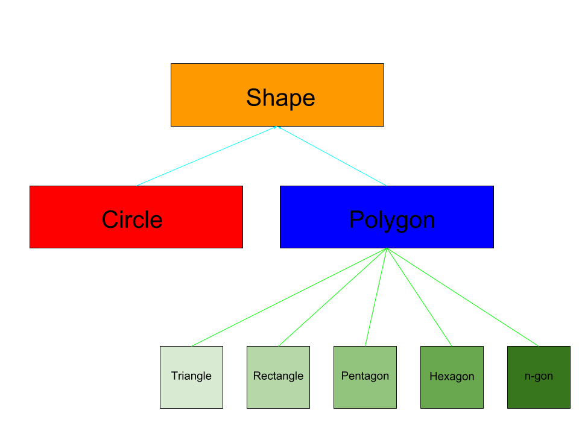

# C:heavy_plus_sign::heavy_plus_sign: To PostScript Library
CS372 Project 2 

## First Draft Shape Class Structure

#### Figure 1:
> Cyan arrow lines represent inheritance
>
> Green lines represent a modular member function (note: they could also be derived classes, but this may be sloppy)
